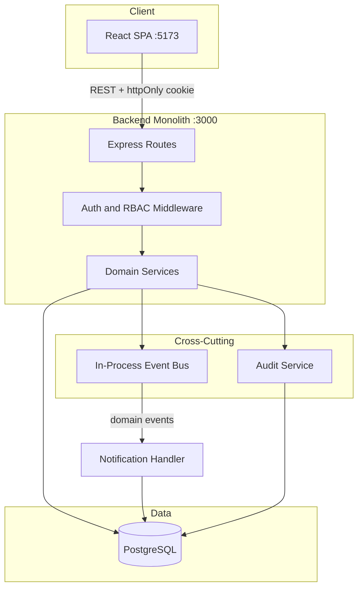
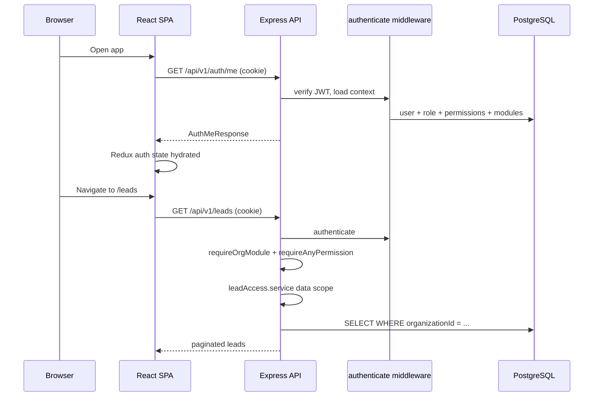
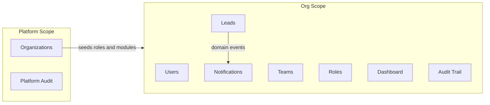
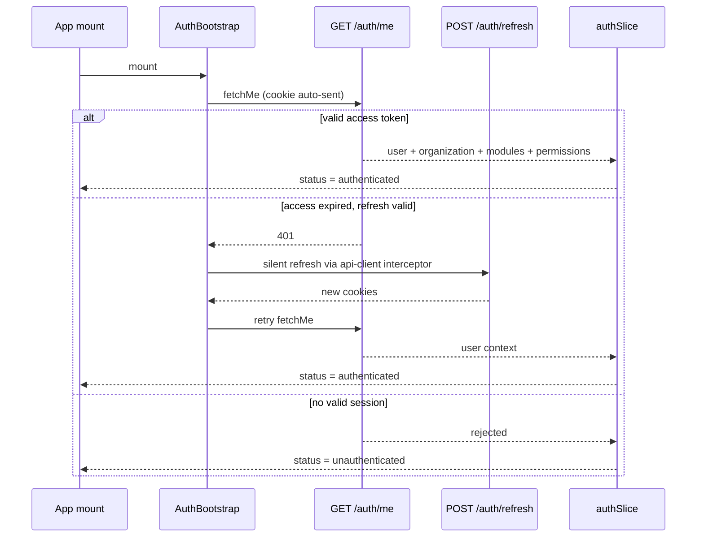
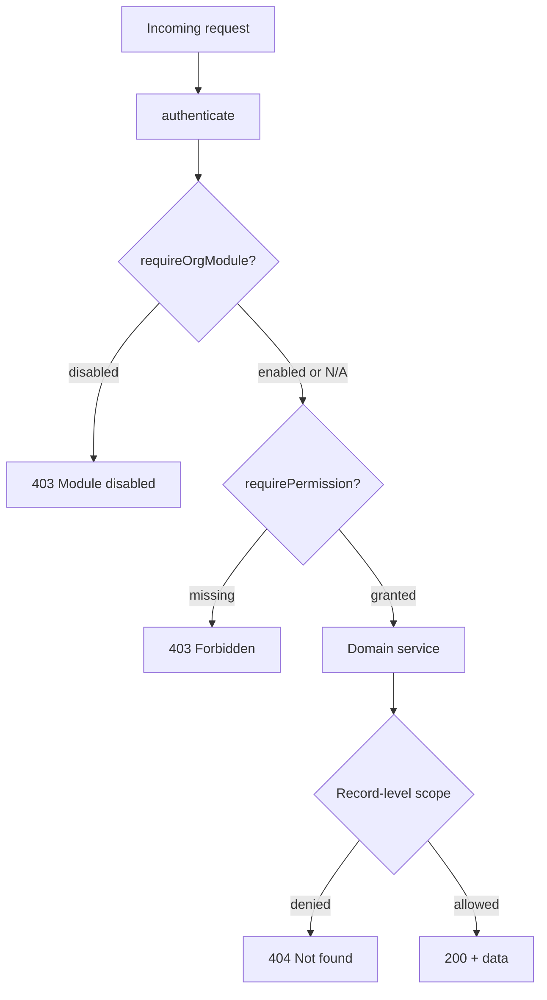
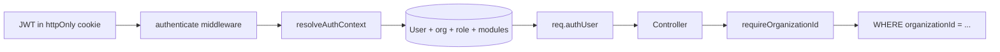
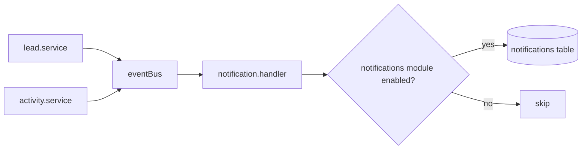
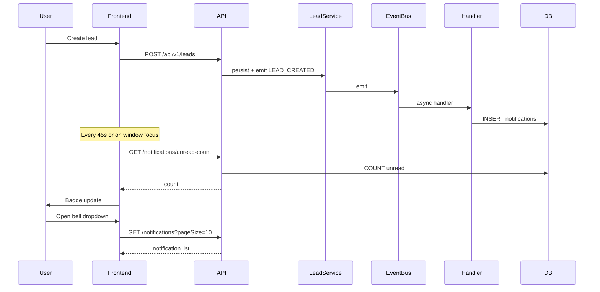

# Architecture

System architecture for HILITE Sales OS — a multi-tenant Sales ERP MVP.

**Related documentation:**

- [Database schema](database-schema.md) — table-level reference (note: `audit_logs` is documented here; see Multi-Tenant Design)
- [ER diagram](er-diagram.md) — entity relationships

---

## Introduction

HILITE Sales OS is a multi-tenant sales platform that supports multiple organizations with isolated users, teams, leads, and dashboards. Platform administrators manage organizations cross-tenant; org administrators configure users, roles, and teams within their tenant.

| Layer    | Technology                                                                         |
| -------- | ---------------------------------------------------------------------------------- |
| Frontend | React 19, Vite, Redux Toolkit, React Router, Axios                                 |
| Backend  | Express 5, TypeScript, Prisma 7                                                    |
| Database | PostgreSQL 16 (Docker Compose for local dev)                                       |
| Monorepo | `apps/frontend`, `apps/backend`, root scripts in [`package.json`](../package.json) |

**Local endpoints:**

- API: `http://localhost:3000`
- Frontend: `http://localhost:5173`

The backend follows a consistent layering pattern: **routes → controllers → services → repositories → Prisma**. Cross-cutting concerns (authentication, RBAC, org module gates, audit logging, domain events) sit alongside domain services rather than in separate deployable services.

---

## System Architecture Diagram

### Logical overview



### Request lifecycle

A typical authenticated org request flows through cookie-based JWT verification, permission checks, and service-layer tenant scoping.



**Key integration points:**

| Concern               | Source of truth                                                                                           |
| --------------------- | --------------------------------------------------------------------------------------------------------- |
| CORS + cookie parsing | [`apps/backend/src/app.ts`](../apps/backend/src/app.ts)                                                   |
| Axios credentials     | [`apps/frontend/src/lib/api-client.ts`](../apps/frontend/src/lib/api-client.ts) — `withCredentials: true` |
| Route map             | [`apps/backend/src/routes/index.ts`](../apps/backend/src/routes/index.ts)                                 |

### Backend layering example (Leads)

| Layer      | File                                                                        |
| ---------- | --------------------------------------------------------------------------- |
| Routes     | [`lead.routes.ts`](../apps/backend/src/routes/lead.routes.ts)               |
| Controller | [`lead.controller.ts`](../apps/backend/src/controllers/lead.controller.ts)  |
| Service    | [`lead.service.ts`](../apps/backend/src/services/lead.service.ts)           |
| Repository | [`lead.repository.ts`](../apps/backend/src/repositories/lead.repository.ts) |
| Schema     | [`schema.prisma`](../apps/backend/prisma/schema.prisma)                     |

API responses are wrapped in a uniform envelope (`{ success, message, data }`) via `successResponseMiddleware`. The frontend unwraps this in `unwrapResponse`.

---

## Module Boundaries

The system is organized into three overlapping boundary types: **API route modules**, **frontend feature modules**, and **per-org feature toggles**.

### Backend API modules

| Prefix                  | Scope    | Gating                                             | Domain                                   |
| ----------------------- | -------- | -------------------------------------------------- | ---------------------------------------- |
| `/api/v1/auth`          | Both     | Public login; authenticated `/me`, `/logout`       | Session bootstrap                        |
| `/api/v1/platform`      | Platform | `platform:*` permissions                           | Org CRUD, module toggles, platform audit |
| `/api/v1/users`         | Org      | `users:*`                                          | User management                          |
| `/api/v1/teams`         | Org      | `teams:*`                                          | Team management                          |
| `/api/v1/roles`         | Org      | `roles:*`                                          | Role and permission grants               |
| `/api/v1/leads`         | Org      | `leads:*`, `activities:write` + `sales_erp` module | CRM pipeline                             |
| `/api/v1/dashboard`     | Org      | Dashboard permissions + `dashboards` module        | Analytics                                |
| `/api/v1/notifications` | Org      | `notifications` module                             | In-app alerts                            |
| `/api/v1/audit`         | Org      | `audit:read`                                       | Org audit trail                          |
| `/api/v1/permissions`   | Org      | Authenticated                                      | Permission catalog for role UI           |

Middleware is applied **per route**, not globally. Only protected endpoints require `authenticate`.

### Frontend feature modules

Each feature lives under `apps/frontend/src/features/`. Shared global state uses the slice pattern documented in [`store.ts`](../apps/frontend/src/app/store.ts): `service.ts` → `slice.ts` → `selectors.ts` → components.

| Feature           | Redux slice        | Routes                                                                      | Nav visibility                                   |
| ----------------- | ------------------ | --------------------------------------------------------------------------- | ------------------------------------------------ |
| **auth**          | `auth`             | `/login`, bootstrap                                                         | N/A                                              |
| **platform**      | `platform`         | `/platform/organizations`, `/platform/organizations/:id`, `/platform/audit` | Platform group in sidebar                        |
| **audit**         | `audit`            | `/audit`                                                                    | `audit:read` permission                          |
| **users**         | `users`            | `/users`                                                                    | `users:read`                                     |
| **teams**         | `teams`            | `/teams`, `/teams/:id`, `/my-team`                                          | `teams:read` (admin Teams); `users:read:team` + not `teams:read` (My team nav); `users:write:team` (add member) |
| **leads**         | `leads`            | `/leads`, `/leads/:id`                                                      | `sales_erp` module + any lead read permission    |
| **notifications** | `notifications`    | `/notifications`                                                            | Notification bell (module-gated; not in sidebar) |
| **dashboard**     | None (local state) | `/dashboard`                                                                | `dashboards` module                              |
| **roles**         | None (hooks)       | `/roles`                                                                    | `roles:read` (all org roles); `roles:read:team` (team-assignable roles only, read-only) |
| **legal**         | None               | `/privacy`, `/terms`                                                        | Public                                           |

Route guards are defined in [`AppRouter.tsx`](../apps/frontend/src/routes/AppRouter.tsx). Navigation visibility is controlled in [`AppSidebar.tsx`](../apps/frontend/src/layouts/AppSidebar.tsx).

### Org feature modules (per-tenant toggles)

Defined in [`orgModules.ts`](../apps/backend/src/constants/orgModules.ts):

| Key             | Gated routes              | Effect when disabled                          |
| --------------- | ------------------------- | --------------------------------------------- |
| `sales_erp`     | `/api/v1/leads/*`         | Leads nav hidden; lead operations unavailable |
| `dashboards`    | `/api/v1/dashboard`       | Dashboard nav hidden                          |
| `notifications` | `/api/v1/notifications/*` | Bell hidden; no new notifications created     |

Enforced by [`requireOrgModule.ts`](../apps/backend/src/middleware/requireOrgModule.ts). Platform admins enable or disable modules per org via `PATCH /api/v1/platform/organizations/:id/modules`. New organizations receive all modules by default during provisioning.

### Boundary rules

1. **Platform vs org** — Platform users (`organizationId: null`) access cross-tenant APIs under `/api/v1/platform/*`. Org users never pass a tenant ID in URLs; the tenant is implicit from the authenticated user context.
2. **UI gating is advisory** — Frontend route guards and sidebar visibility improve UX. The backend middleware and service-layer scoping are authoritative.
3. **Audit vs notifications** — Audit logs are written synchronously by domain services for compliance ([`audit.service.ts`](../apps/backend/src/services/audit.service.ts)). Notifications are async, event-driven user alerts ([`notification.handler.ts`](../apps/backend/src/handlers/notification.handler.ts)).

### Module dependency diagram



---

## Authentication Strategy

Authentication uses a **dual-cookie model**: a short-lived stateless access JWT plus a long-lived opaque refresh token stored server-side (hashed in PostgreSQL). Access tokens are verified without a DB lookup; refresh tokens support rotation, revocation, and reuse detection.

### Token and cookies

| Topic                 | Implementation                                                                                            |
| --------------------- | --------------------------------------------------------------------------------------------------------- |
| Access token payload  | `{ sub: userId, orgId: string \| null }`                                                                  |
| Access token signing  | [`jwt.ts`](../apps/backend/src/lib/jwt.ts) — `JWT_SECRET`, `JWT_EXPIRES_IN` (default `15m`)               |
| Refresh token         | Opaque random string; SHA-256 hash stored in `refresh_tokens` — [`refreshToken.ts`](../apps/backend/src/lib/refreshToken.ts) |
| Refresh token lifetime | `REFRESH_TOKEN_EXPIRES_IN` (default `7d`)                                                              |
| Cookie names          | `access_token`, `refresh_token`                                                                           |
| Cookie options        | httpOnly, `sameSite: "none"`, configurable `secure` — [`cookie.ts`](../apps/backend/src/config/cookie.ts) |
| CORS                  | `credentials: true` on backend; frontend sends cookies via `withCredentials: true`                        |

### Auth endpoints

| Method | Path                    | Behavior                                                                                   |
| ------ | ----------------------- | ------------------------------------------------------------------------------------------ |
| `POST` | `/api/v1/auth/login`    | bcrypt password verify → set both cookies → `{ message: "Login successful" }`            |
| `POST` | `/api/v1/auth/refresh`  | Validate refresh cookie → rotate token → set both cookies → `{ message: "Token refreshed" }` |
| `GET`  | `/api/v1/auth/me`       | Reload full auth context from DB (requires valid access token)                             |
| `POST` | `/api/v1/auth/logout`   | Revoke refresh token + clear both cookies + audit event (no access token required)       |

**Source files:** [`auth.controller.ts`](../apps/backend/src/controllers/auth.controller.ts), [`auth.service.ts`](../apps/backend/src/services/auth.service.ts), [`auth.routes.ts`](../apps/backend/src/routes/auth.routes.ts), [`refreshToken.repository.ts`](../apps/backend/src/repositories/refreshToken.repository.ts).

### Refresh token rotation

- Each login creates a new token **family** (`family_id`).
- Each refresh revokes the current refresh token and issues a new one in the same family.
- If a revoked refresh token is reused, the entire family is revoked (`AUTH_SESSION_REVOKED` audit event).

### Login guards

Login is rejected when:

- Credentials are invalid → `401`
- User status is `INACTIVE` → `403 ACCOUNT_INACTIVE`
- Organization is `SUSPENDED` or missing → `403 ORG_SUSPENDED`
- No role is assigned → `403 ROLE_NOT_ASSIGNED`

### Session bootstrap (frontend)



**Frontend components:**

| Component                                                                                | Role                                             |
| ---------------------------------------------------------------------------------------- | ------------------------------------------------ |
| [`AuthBootstrap.tsx`](../apps/frontend/src/features/auth/components/AuthBootstrap.tsx)   | Dispatches `fetchMe` on first load               |
| [`ProtectedRoute.tsx`](../apps/frontend/src/features/auth/components/ProtectedRoute.tsx) | Redirects unauthenticated users to `/login`      |
| [`GuestRoute.tsx`](../apps/frontend/src/features/auth/components/GuestRoute.tsx)         | Redirects authenticated users away from `/login` |
| [`authSlice.ts`](../apps/frontend/src/features/auth/authSlice.ts)                        | Redux state for login, logout, and bootstrap     |

### Security notes

- **JWT `orgId` is informational only.** On every request, `authenticate` resolves the full context from the database using `sub` (user ID). Role and permission changes take effect immediately without re-login.
- **Cookie-based auth** mitigates XSS token theft compared to `localStorage`, but requires aligned `FRONTEND_URL`, CORS credentials, and `COOKIE_SECURE` in production.

---

## Authorization Strategy

Authorization is **role-based access control (RBAC)** with two enforcement layers: route middleware for coarse gates, and service-layer scoping for record-level access.

### Permission check flow



### Layer 1 — Route middleware

| Middleware             | File                                                                                | Semantics                                          |
| ---------------------- | ----------------------------------------------------------------------------------- | -------------------------------------------------- |
| `authenticate`         | [`authenticate.ts`](../apps/backend/src/middleware/authenticate.ts)                 | Verifies JWT, attaches `req.authUser: AuthContext` |
| `requirePermission`    | [`requirePermission.ts`](../apps/backend/src/middleware/requirePermission.ts)       | Caller must have **all** listed permissions (AND)  |
| `requireAnyPermission` | [`requireAnyPermission.ts`](../apps/backend/src/middleware/requireAnyPermission.ts) | Caller must have **any** listed permission (OR)    |
| `requireOrgModule`     | [`requireOrgModule.ts`](../apps/backend/src/middleware/requireOrgModule.ts)         | Org must have the feature module enabled           |

`AuthContext` shape: [`types/auth.ts`](../apps/backend/src/types/auth.ts) — `user`, `organization`, `modules`.

### Layer 2 — Service data scoping

Middleware answers "can this user perform this action?" Services answer "can this user access **this specific record**?"

**Leads** — [`leadAccess.service.ts`](../apps/backend/src/services/leadAccess.service.ts):

| Permission        | List scope               | Single-record access  |
| ----------------- | ------------------------ | --------------------- |
| `leads:read:org`  | All org leads            | Any lead in org       |
| `leads:read:team` | Leads on caller's team   | Lead on caller's team |
| `leads:read`      | Leads assigned to caller | Only assigned leads   |

**Users** — [`user.service.ts`](../apps/backend/src/services/user.service.ts): similar team vs org-wide pattern with `users:read` and `users:read:team`.

Cross-tenant record access returns `404 Not found` (not `403`) to avoid leaking existence of records in other organizations.

### RBAC data model

```
User ──(1:1)── UserRoleAssignment ── Role ──(M:N)── Permission
  │                              │
  └── organizationId             └── membershipScope: TEAM | ORGANIZATION
  └── TeamMember (0..1 team)
```

- **One role per user** — `UserRoleAssignment` has a unique constraint on `userId`.
- **Permissions** — Global catalog with scope `PLATFORM` or `ORGANIZATION`. Keys defined in [`permissions.ts`](../apps/backend/src/constants/permissions.ts); metadata in [`permissionCatalog.ts`](../apps/backend/src/constants/permissionCatalog.ts).
- **Role management** — [`role.service.ts`](../apps/backend/src/services/role.service.ts) validates permission keys and enforces team vs org-wide grant rules.

### Default roles

Seeded from [`defaultRoles.ts`](../apps/backend/src/constants/defaultRoles.ts):

| Role             | Scope                             | Typical permissions                                          |
| ---------------- | --------------------------------- | ------------------------------------------------------------ |
| `platform_admin` | Platform (`organizationId: null`) | `platform:orgs:read/write`, `platform:audit:read`            |
| `org_admin`      | Organization                      | Users, teams, roles (read/write); org-wide leads; audit read |
| `executive`      | Team (requires team membership)   | Own leads, status write, activities, `dashboard:me`          |
| `team_lead`      | Team (requires team membership)   | Team Leader — team users / leads in team, team status write, `dashboard:team` |
| `sales_manager`  | Organization                      | Org-wide leads (read/write)                                    |
| `director`       | Organization                      | Org-wide leads (read/write), `dashboard:org`                   |

Built-in role slugs are protected from deletion. Custom roles can be created by org admins with permissions from the catalog.

### Frontend authorization mirrors

| Mechanism                   | File                                                                                                                                                                    |
| --------------------------- | ----------------------------------------------------------------------------------------------------------------------------------------------------------------------- |
| Route-level permission gate | [`RequirePermission.tsx`](../apps/frontend/src/features/auth/components/RequirePermission.tsx)                                                                          |
| Selectors                   | [`authSelectors.ts`](../apps/frontend/src/features/auth/authSelectors.ts) — `selectHasPermission`, `selectHasAnyPermission`, `selectHasModule`, `selectIsPlatformAdmin` |
| Sidebar visibility          | [`AppSidebar.tsx`](../apps/frontend/src/layouts/AppSidebar.tsx)                                                                                                         |

---

## Multi-Tenant Design

HILITE Sales OS uses **shared-database, row-level multi-tenancy**. Each tenant is an `Organization` row; domain data is isolated via `organizationId` foreign keys.

### What we do not use

- Per-tenant databases or schemas
- Subdomain-based tenant routing
- Tenant ID in org-scoped API URLs

### Tenant context flow



1. JWT is verified; user ID (`sub`) loads full context from the database.
2. Controllers pass `req.authUser.organization.id` into services.
3. Services call `requireOrganizationId()` — platform users without an org context receive `403 Organization context is required`.
4. Repositories scope every query with `organizationId`.

### Tenant-scoped tables

| Table                             | `organizationId`        | Notes                                                        |
| --------------------------------- | ----------------------- | ------------------------------------------------------------ |
| `teams`, `leads`, `notifications` | Required                | Always tenant-scoped                                         |
| `organization_modules`            | Required (composite PK) | Per-org feature toggles                                      |
| `users`                           | Nullable                | `null` = platform admin                                      |
| `roles`                           | Nullable                | `null` = platform-level role                                 |
| `audit_logs`                      | Nullable                | `null` for platform-wide events (org create, platform login) |

`activities` are scoped indirectly via `Lead → organizationId`. See [`schema.prisma`](../apps/backend/prisma/schema.prisma) and [ER diagram](er-diagram.md).

### Platform vs org users

| User type      | `organizationId` | API scope                         | Cross-tenant access                |
| -------------- | ---------------- | --------------------------------- | ---------------------------------- |
| Platform admin | `null`           | `/api/v1/platform/*`              | Yes, with `platform:*` permissions |
| Org user       | Set              | `/api/v1/{users,teams,leads,...}` | No — implicit tenant from auth     |

Platform audit (`GET /api/v1/platform/audit`) can filter across tenants. Org audit (`GET /api/v1/audit`) is limited to the caller's organization.

### Organization provisioning

New organizations are created in a single transaction in [`organization.repository.ts`](../apps/backend/src/repositories/organization.repository.ts):

1. Create `Organization`
2. Seed default roles (`seedDefaultRolesForOrg`)
3. Seed default modules (`seedDefaultModulesForOrg`)
4. Create org admin user and assign `org_admin` role

### Suspension

Organizations with `status: SUSPENDED` block login for all org users. Enforced in [`auth.service.ts`](../apps/backend/src/services/auth.service.ts) during login and context resolution.

---

## Notification Design

Notifications use an **event-driven write, REST read (polling)** model. There are no WebSockets, SSE, or external message queues in the MVP.

### Design rationale

Domain services emit events (`LEAD_CREATED`, `LEAD_ASSIGNED`, etc.) without knowing subscribers. An in-process event bus dispatches to a notification handler that persists in-app alerts. This keeps the MVP simple: notification delivery is lightweight and runs in the same monolith. An external queue can be added later for email or high-volume fan-out.

### Event pipeline



| Step                 | File                                                                                                                                         | Role                                                                                         |
| -------------------- | -------------------------------------------------------------------------------------------------------------------------------------------- | -------------------------------------------------------------------------------------------- |
| Event types          | [`domainEvents.ts`](../apps/backend/src/events/domainEvents.ts)                                                                              | `LEAD_CREATED`, `LEAD_ASSIGNED`, `LEAD_REASSIGNED`, `LEAD_STATUS_CHANGED`, `ACTIVITY_LOGGED` |
| Emitters             | [`lead.service.ts`](../apps/backend/src/services/lead.service.ts), [`activity.service.ts`](../apps/backend/src/services/activity.service.ts) | Publish after successful DB writes                                                           |
| Event bus            | [`eventBus.ts`](../apps/backend/src/lib/eventBus.ts)                                                                                         | In-process Node `EventEmitter`; fire-and-forget async handlers                               |
| Handler registration | [`registerHandlers.ts`](../apps/backend/src/lib/registerHandlers.ts)                                                                         | Wired at server startup                                                                      |
| Handler logic        | [`notification.handler.ts`](../apps/backend/src/handlers/notification.handler.ts)                                                            | Recipient rules, module gate, bulk insert                                                    |

Handler errors are caught and logged (`safeHandler`); they do not propagate to the emitter.

### Recipient rules

| Event                 | Recipients                     | Exclusions                        |
| --------------------- | ------------------------------ | --------------------------------- |
| `LEAD_CREATED`        | Team leaders for the lead's team | Actor                             |
| `LEAD_ASSIGNED`       | New assignee                   | Self-assignment                   |
| `LEAD_REASSIGNED`     | Previous assignee              | Actor was previous assignee       |
| `LEAD_STATUS_CHANGED` | Current assignee               | No assignee, or actor is assignee |
| `ACTIVITY_LOGGED`     | Team leaders                     | Actor is already a team leader      |

All notifications are gated by the `notifications` org module via `organizationModuleService.isModuleEnabled`.

### API endpoints

Base path: `/api/v1/notifications` (requires auth + `notifications` module).

| Method  | Path            | Purpose                                                   |
| ------- | --------------- | --------------------------------------------------------- |
| `GET`   | `/`             | Paginated list (`unreadOnly`, `page`, `pageSize` max 100) |
| `GET`   | `/unread-count` | Unread badge count                                        |
| `PATCH` | `/:id/read`     | Mark one notification read                                |
| `PATCH` | `/read-all`     | Mark all read                                             |

### Frontend delivery



| Concern          | Implementation                                                                                                           |
| ---------------- | ------------------------------------------------------------------------------------------------------------------------ |
| Polling interval | 45 seconds — [`useNotificationPolling.ts`](../apps/frontend/src/features/notifications/hooks/useNotificationPolling.ts)  |
| Focus refresh    | Re-fetches unread count on `window.focus`                                                                                |
| Dropdown         | Fetches latest 10 on open (not on every poll)                                                                            |
| Full page        | [`NotificationsPage.tsx`](../apps/frontend/src/features/notifications/pages/NotificationsPage.tsx) with URL query params |
| UI gating        | Bell shown only when authenticated, org context exists, and `notifications` module is enabled                            |

### Limitations

- Events are **not durable** — a process crash between emit and DB write can lose notifications.
- **No retry or dead-letter queue** — handler failures are logged only.
- **No email or SMS channels** — in-app only.
- **Polling latency** — users see new alerts within ~45 seconds (or immediately on tab focus / dropdown open).

---

## Scaling Considerations

The codebase is optimized for MVP delivery and single-instance local development, not multi-region production scale. This section separates **current constraints** from **recommended evolution paths**.

### Current MVP constraints

| Area            | Current state                                                                                                               |
| --------------- | --------------------------------------------------------------------------------------------------------------------------- |
| Deployment      | Docker Compose runs PostgreSQL only; no backend/frontend container or CI/CD                                                 |
| API instances   | Single-node monolith; in-process event bus does not work across multiple instances                                          |
| Notifications   | Fire-and-forget handlers; no retry; silent loss on crash or transient DB error                                              |
| Client delivery | 45-second polling → `N_users / 45s` unread-count requests                                                                   |
| Caching         | None — every poll runs `COUNT(*)` against PostgreSQL                                                                        |
| Rate limiting   | Not implemented on the API                                                                                                  |
| Database        | Single Postgres; no read replicas or connection-pool tuning beyond defaults                                                 |
| Data growth     | `notifications` and `audit_logs` tables grow unbounded with no archival strategy                                            |

### Recommended evolution

| Concern                        | Current              | Recommended path                                                                                                                                         |
| ------------------------------ | -------------------- | -------------------------------------------------------------------------------------------------------------------------------------------------------- |
| Horizontal API                 | Single instance      | JWT is already stateless; replace in-process event bus with Redis Pub/Sub or transactional outbox for multi-instance fan-out                             |
| Notifications                  | In-process + polling | Message queue (Bull, SQS) + WebSocket/SSE push; separate email worker                                                                                    |
| DB load                        | Single Postgres      | Connection pool tuning, read replicas for list endpoints; indexes exist on `notifications.[userId, readAt]` and `audit_logs.[organizationId, createdAt]` |
| Caching                        | None                 | Redis for unread counts and permission catalog                                                                                                           |
| Deployment                     | Local dev only       | Containerize backend, static frontend on CDN, managed Postgres; secrets for `JWT_SECRET`, `DATABASE_URL`, `COOKIE_SECURE`, `FRONTEND_URL`                |
| Observability                  | Console logs         | Structured logging and metrics                                                                                                                           |
| Audit / notification retention | Unbounded            | Time-based archival or partitioning for compliance tables                                                                                                |

Graceful shutdown is implemented (`SIGINT`/`SIGTERM` → close server, disconnect Prisma, end connection pool), which is a foundation for container orchestration but not sufficient on its own for production readiness.
