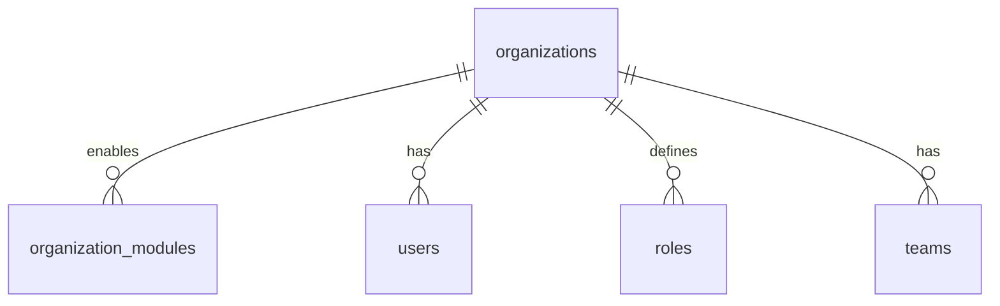
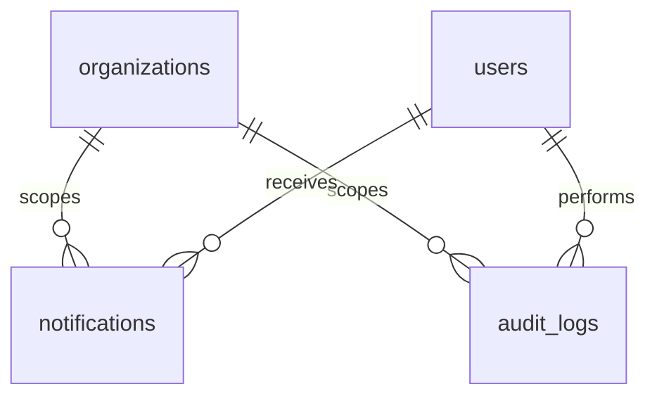

# ER Diagram

Entity-relationship diagram for the Hilite ERP PostgreSQL database.

**Source of truth:** [`apps/backend/prisma/schema.prisma`](../apps/backend/prisma/schema.prisma)

## Full diagram

```mermaid
erDiagram
    organizations ||--o{ organization_modules : "enables"
    organizations ||--o{ users : "has"
    organizations ||--o{ roles : "defines"
    organizations ||--o{ teams : "has"
    organizations ||--o{ leads : "owns"
    organizations ||--o{ notifications : "scopes"
    organizations ||--o{ audit_logs : "scopes"

    users ||--o| user_roles : "assigned"
    users ||--o| user_dashboard_layouts : "customizes"
    users ||--o{ refresh_tokens : "has sessions"
    roles ||--o{ user_roles : "grants"
    roles ||--o{ role_permissions : "includes"
    permissions ||--o{ role_permissions : "granted via"

    teams ||--o{ team_members : "contains"
    users ||--o{ team_members : "belongs to"
    teams ||--o{ leads : "owns"

    users ||--o{ leads : "creates"
    users ||--o{ leads : "assigned to"
    leads ||--o{ activities : "has"
    users ||--o{ activities : "logged by"
    users ||--o{ notifications : "receives"
    users ||--o{ audit_logs : "performs"

    organizations {
        uuid id PK
        string name
        string code UK
        string logo_url
        string description
        enum status
        datetime created_at
        datetime updated_at
    }

    organization_modules {
        uuid organization_id PK_FK
        enum module_key PK
        boolean enabled
        datetime updated_at
    }

    users {
        uuid id PK
        string email UK
        string name
        string phone_number
        string password_hash
        boolean must_change_password
        enum status
        uuid organization_id FK
        datetime created_at
        datetime updated_at
    }

    user_dashboard_layouts {
        uuid user_id PK_FK
        string view
        json widgets
        datetime updated_at
    }

    refresh_tokens {
        uuid id PK
        uuid user_id FK
        string token_hash UK
        uuid family_id
        datetime expires_at
        datetime revoked_at
        datetime created_at
    }

    roles {
        uuid id PK
        uuid organization_id FK
        string name
        string slug
        enum membership_scope
        datetime created_at
        datetime updated_at
    }

    permissions {
        string key PK
        string label
        string description
        enum scope
    }

    role_permissions {
        uuid role_id PK_FK
        string permission_key PK_FK
    }

    user_roles {
        uuid user_id PK_FK
        uuid role_id PK_FK
    }

    teams {
        uuid id PK
        uuid organization_id FK
        string name
        datetime created_at
        datetime updated_at
    }

    team_members {
        uuid team_id PK_FK
        uuid user_id PK_FK
    }

    leads {
        uuid id PK
        uuid organization_id FK
        uuid team_id FK
        uuid assigned_to_id FK
        string name
        string mobile_number
        string email
        string source
        string project
        enum status
        uuid created_by_id FK
        datetime created_at
        datetime updated_at
    }

    activities {
        uuid id PK
        uuid lead_id FK
        enum type
        string notes
        uuid created_by_id FK
        datetime created_at
    }

    notifications {
        uuid id PK
        uuid organization_id FK
        uuid user_id FK
        enum type
        string title
        string body
        string entity_type
        string entity_id
        datetime read_at
        datetime created_at
    }

    audit_logs {
        uuid id PK
        uuid organization_id FK
        uuid actor_id FK
        enum action
        string entity_type
        string entity_id
        json metadata
        datetime created_at
    }
```

## Domain views

### Tenancy and modules



### RBAC

```mermaid
erDiagram
    users ||--o| user_roles : has
    roles ||--o{ user_roles : assigned to
    roles ||--o{ role_permissions : grants
    permissions ||--o{ role_permissions : included in
    organizations ||--o{ roles : owns
```

### Sales CRM

```mermaid
erDiagram
    organizations ||--o{ leads : owns
    teams ||--o{ leads : scoped to
    users ||--o{ leads : creates
    users ||--o{ leads : assigned to
    leads ||--o{ activities : has
    users ||--o{ activities : logged by
    teams ||--o{ team_members : contains
    users ||--o{ team_members : member of
```

### Notifications and audit



## Relationship cardinality

| From         | To                 | Cardinality | Junction / notes                                      |
| ------------ | ------------------ | ----------- | ----------------------------------------------------- |
| Organization | User               | 1:N         | `users.organization_id` (nullable for platform users) |
| Organization | Role               | 1:N         | `roles.organization_id` (nullable for platform role)  |
| Organization | Team               | 1:N         |                                                       |
| Organization | Lead               | 1:N         |                                                       |
| Organization | Notification       | 1:N         | `notifications.organization_id` nullable for platform users |
| Organization | AuditLog           | 1:N         | `audit_logs.organization_id` nullable for platform events   |
| User         | UserDashboardLayout | 1:0..1     | One saved layout per user                                   |
| User         | RefreshToken       | 1:N         | Server-side refresh sessions                                |
| User         | AuditLog           | 1:N         | As actor (`actor_id`, optional)                             |
| Organization | OrganizationModule | 1:N         | Composite PK on `(organization_id, module_key)`       |
| User         | Role               | N:1         | Via `user_roles`; one role per user                   |
| Role         | Permission         | N:M         | Via `role_permissions`                                |
| Team         | User               | N:M         | Via `team_members`                                    |
| Team         | Lead               | 1:N         | Required FK on every lead                             |
| User         | Lead               | 1:N         | As creator (`created_by_id`)                          |
| User         | Lead               | 1:N         | As assignee (`assigned_to_id`, optional)              |
| Lead         | Activity           | 1:N         |                                                       |
| User         | Activity           | 1:N         | As author (`created_by_id`)                           |
| User         | Notification       | 1:N         |                                                       |

## Key constraints

- **One role per user** — `user_roles.user_id` is unique.
- **Leads are team-scoped** — every lead requires a team; team delete is `RESTRICT` when leads exist.
- **Protected references** — lead creator and activity author use `ON DELETE RESTRICT`.
- **Optional assignee** — lead assignee uses `ON DELETE SET NULL`.
